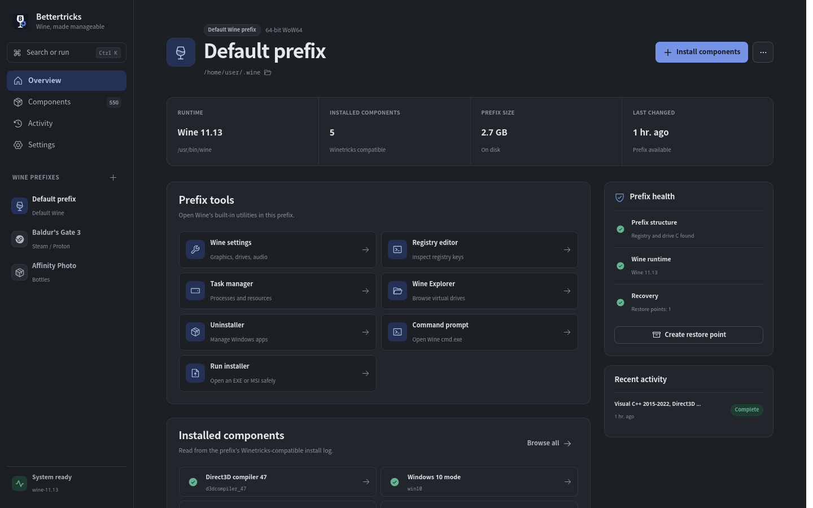
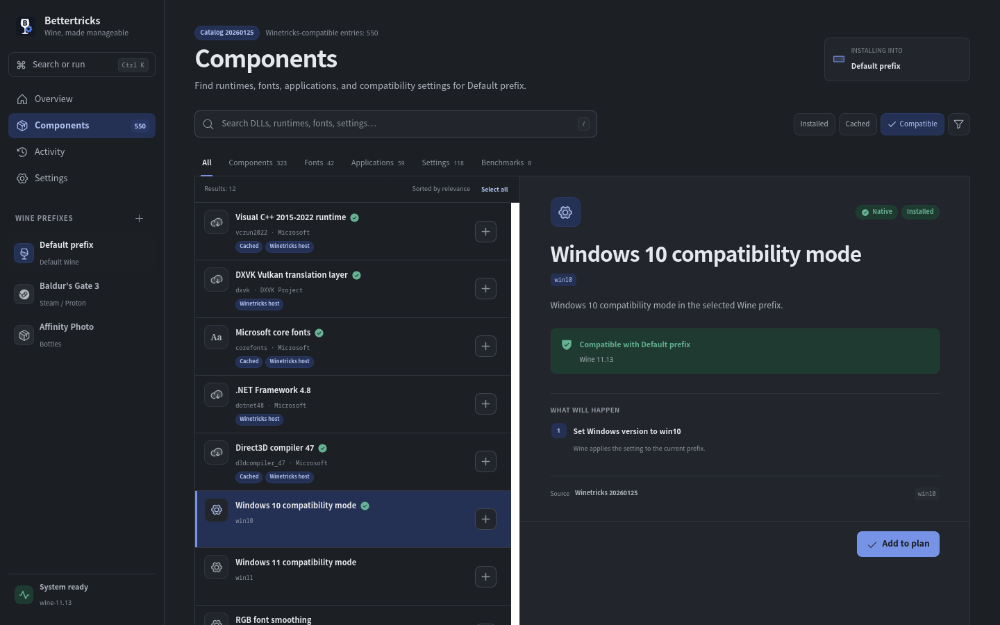
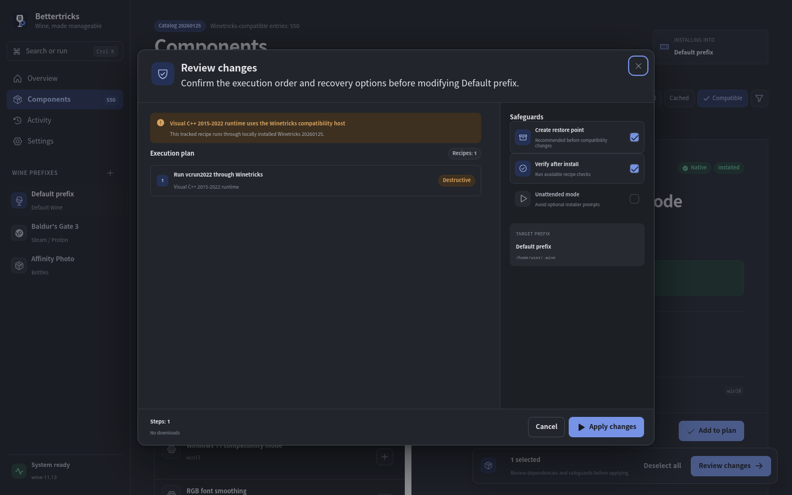
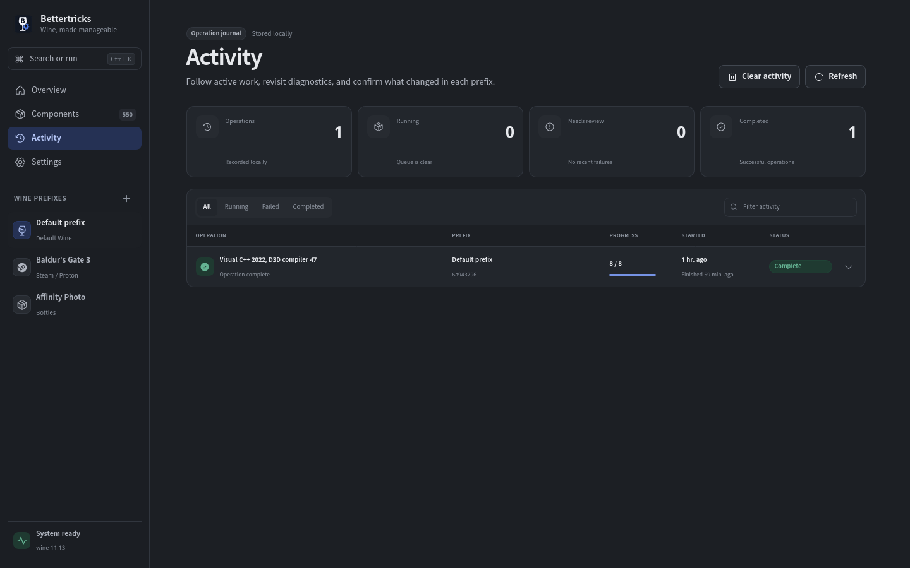
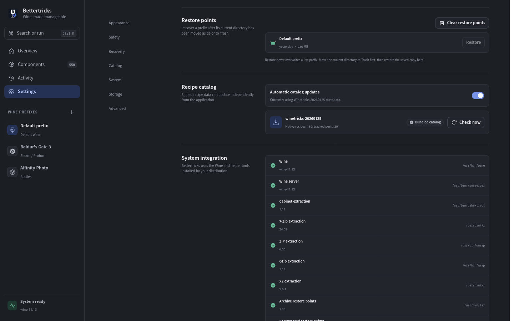

# Bettertricks

Bettertricks is a recovery-first Wine prefix manager and Winetricks-compatible recipe
engine for Linux. It combines a native Rust core, a Tauri and React desktop app, and a
scripting-friendly `bettertricks` CLI.

The app discovers standard Wine prefixes plus Steam, Lutris, Bottles, and Heroic prefixes;
previews every operation; shares Winetricks' download cache; checksum-imports required manual
downloads from the review screen; records activity; and creates
reflink or compressed restore points before risky changes. It contains no telemetry.

The desktop interface can switch live between English, Turkish, Spanish, Italian, French,
German, Russian, Arabic, Simplified Chinese, Japanese, and Korean. Language choice is stored in
local settings; Arabic also enables a mirrored right-to-left layout. Catalog-authored recipe text
and upstream diagnostic output remain in their source language so technical evidence is not
silently altered.

## Screenshots

English interface shown with the bundled preview data.



| Component catalog | Review changes |
| --- | --- |
|  |  |
| **Activity history** | **Recovery and system settings** |
|  |  |

## Project status

Bettertricks `1.0` is release-gated against all 550 user-visible entries from Winetricks
20260125. Its 159 audited native recipes include all
118 settings verbs, 40 of 42 font verbs, and the deprecated DirectX 9 compatibility no-op.
The 390 non-broken recipes still awaiting native ports run through a checksum-verified
Winetricks host managed by Bettertricks and exactly matched to the 20260125 catalog baseline;
Bettertricks keeps operation
review, prefix locking, cancellation, activity records, and recovery around that upstream
behavior. The one entry marked broken upstream remains disabled. Compatibility-hosted recipes
are never counted as native. See [the parity ledger](docs/parity.md) and
[release verification](docs/release.md).

## Install

Download the AppImage, Debian package, or RPM from
[Bettertricks 1.0 on GitHub Releases](https://github.com/RamazanBerk20/Bettertricks/releases/tag/v1.0).
Arch Linux users can install
[`bettertricks`](https://aur.archlinux.org/packages/bettertricks),
[`bettertricks-bin`](https://aur.archlinux.org/packages/bettertricks-bin), or
[`bettertricks-git`](https://aur.archlinux.org/packages/bettertricks-git) from the AUR.

## Quick start

The included devcontainer is the shortest path to a complete Linux toolchain:

```sh
devcontainer up --workspace-folder .
devcontainer exec --workspace-folder . pnpm dev:web
```

For a configured Linux host:

```sh
corepack enable
pnpm install
pnpm dev
```

The web preview at `http://localhost:1420` uses a realistic local mock backend. `pnpm dev`
launches the real Tauri host and Wine integration.

## Useful commands

```sh
pnpm check                 # TypeScript and Rust checks
pnpm test                  # Frontend and Rust tests
pnpm build:web             # Production web assets
pnpm build                 # Tauri application and Linux bundles
pnpm catalog:generate      # Regenerate native settings/fonts and upstream metadata
pnpm catalog:validate      # Validate every checked-in recipe
pnpm smoke:wine            # Exercise typed recipes in a disposable Wine prefix
pnpm smoke:proton          # Repeat the native smoke against pinned GE-Proton
pnpm smoke:catalog-update  # Sign, activate, and roll back a disposable catalog
pnpm release:checksums     # Generate and verify final package SHA-256 sums
cargo run -p bettertricks -- settings list
cargo run -p bettertricks -- --dry-run win10 fontsmooth=rgb
cargo run -p bettertricks -- --install-compatibility-host
cargo run -p bettertricks -- --manual-file 'recipe.file=/path/to/download.exe'
cargo run -p bettertricks -- --input 'set_mididevice.device=FluidSynth MIDI' set_mididevice
```

Read [development setup](docs/development.md), [architecture](docs/architecture.md),
[accessibility audit](docs/accessibility.md), and [security policy](SECURITY.md) before adding
executable recipes.

## License

Bettertricks is licensed under `LGPL-2.1-or-later`. Generated Winetricks metadata and
behavioral ports retain their upstream provenance; see [NOTICE](NOTICE).
